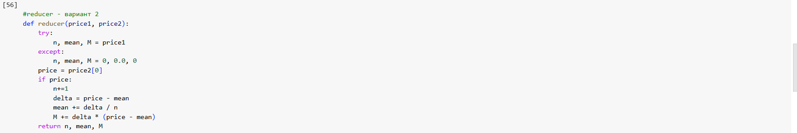

1. Загрузите датасет по ценам на жилье Airbnb, доступный на kaggle.com: https://www.kaggle.com/dgomonov/new-york-city-airbnb-open-data
Подсчитайте среднее значение и дисперсию по признаку ”price” в hive
Задание выаолнить не смогла. Таблицу записала на HDFS,  можно выгрузить ее описание, но при любо запросе сервер вылетает, контейнер останавливается. Подумала что большая таблица, отрезала все кроме id и price, загрузила ее как ny2019_price. Ситуация не изменилась. Сделала тоже самое с таюлицей с семинара, чтобы исключить возможность моей ошибки при загрузке данных - ситуация такая же. Хотя на семинаре один запрос с 5 раза выполнить удалось. Больше сделать ничего не могу, видимо не хватает моему ноутбуку возможностей(

2. Используя Python, реализуйте скрипт mapper.py и reducer.py для расчета
Проверьте правильность подсчета статистики методом mapreduce в сравнении со hive.

Посчитаем при помощи встроенных функций:

mapper:

reducer вариант 1:

 Результат 1: значения сопадают со встроенными функциями

 

reducer вариант2:

Результат: варианта 2 считает немного по другому дисперсию, хотя в прошлом ДЗ оба варианта совпали. Даже если n подставить 48895, все равно дисперсия немного отличается. Почему, интересно??

