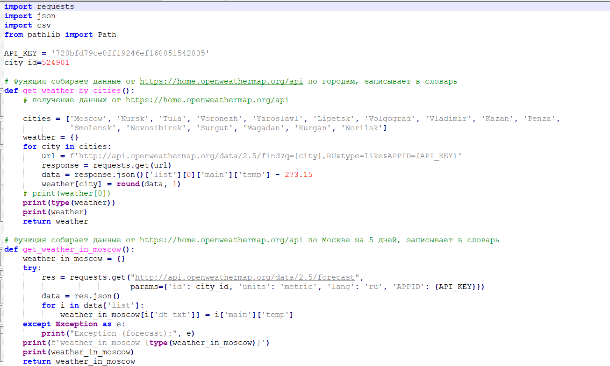
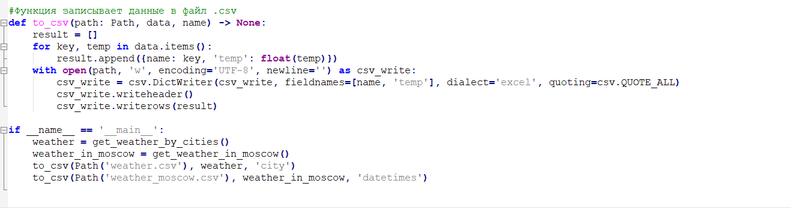
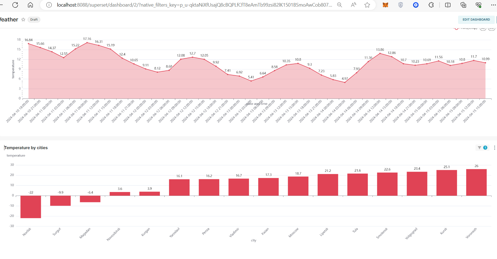

Соберите данные о погоде в разных городах мира за последний месяц. Используйте открытые источники данных, такие как API погодных сервисов или веб-скрейпинг.

Выведите график изменения температуры в разных городах, график распределения температуры.
Данные собираем от https://home.openweathermap.org/api отдельно по городам, и по Москве за несколько дней

Далее записываем данные в файл weather.csv и weather_moscow.csv.

Загружаем оба csv файла в superset, обрабатываем и строим дашборд:

